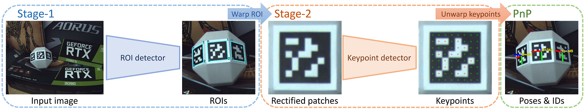
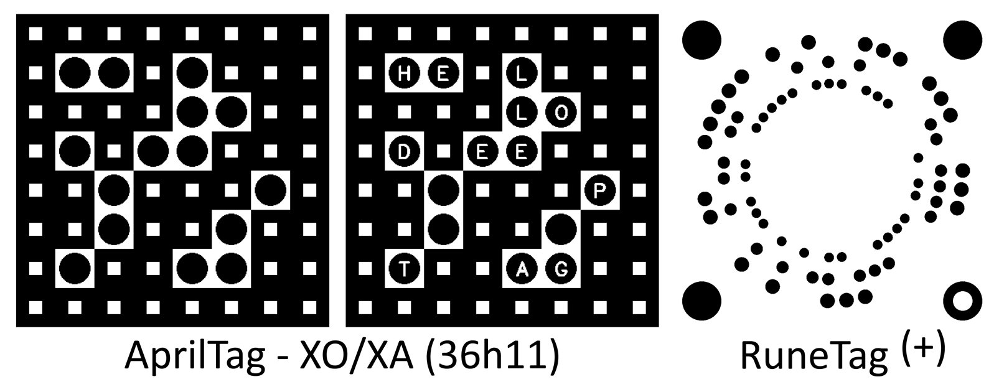

Implementation of paper ***DeepTag: A General Framework for Fiducial Marker Design and Detection***.

**Project page**: https://herohuyongtao.github.io/research/publications/deep-tag/.


## Overview
DeepTag is a general framework for fiducial marker design and detection, which supports existing and newly-designed marker families. DeepTag is a two-stage marker detection pipeline:

* Stage-1: detect ROIs of potential markers;
* Stage-2: detect keypoints and digital symbols inside each ROI, then determine 6-DoF pose and marker ID.




## How to run
- For image input:
  ```
  python test_deeptag.py --config config_image.json
  ```
- For video input:
  ```
  python test_deeptag.py --config config_video.json
  ```

The configuration file is in JSON format. Please modify the configurations to fit your needs. Example configurations files for image and video input are provided (i.e., [config_image.json](config_image.json) and [config_video.json](config_video.json)).

Detail explaination of configuration file:
* `is_video`: `{0, 1}` for image/video respectively.
* `filepath`: path of input image/video (use 0 for webcam input).
* `family`: marker family, currently support `{apriltag, aruco, artoolkitplus, runetag, topotag, apriltagxo}`.
* `hamming_dist`: Hamming dist for checking the marker library; normally, 4 works well enough.
* `codebook`: path of codebook; if it is empty, the default path `codebook/FAMILY_codebook.txt` will be used. For markers with multiple codebooks like AprilTag and ArUco, their default codebooks are for *AprilTag (36h11)* and *ArUco (36h12)* respectively.
* `cameraMatrix`: camera intrinsic matrix, `[fx, 0, cx, 0, fy, cy, 0, 0, 1]`.
* `distCoeffs`: camera distortion coefficients (both radial and tangential), `[k1, k2, p1, p2, k3, k4, k5, k6]`.
* `marker_size`: physical size of the marker.

Besides supporting existing markers like *AprilTag, ArUco, ARToolkitPlus, TopoTag & RuneTag*, DeepTag also supports newly-designed markers like *AprilTag-XO*, *AprilTag-XA* and *RuneTag+* (provided in folders `images_tag`). Set `family` to `apriltagxo` in config for *AprilTag-XO* and *AprilTag-XA*, and `runetag` for *RuneTag+* respectively.




## Terms of use
The source code is provided for research purposes only. Any commercial use is prohibited. When using the code in your research work, please cite the following paper:
> **"DeepTag: A General Framework for Fiducial Marker Design and Detection."**  
> Zhuming Zhang, Yongtao Hu, Guoxing Yu, and Jingwen Dai  
> *[arXiv:2105.13731](http://arxiv.org/abs/2105.13731) (2021)*.
```
@article{zhang2021deeptag,
  title={{DeepTag: A General Framework for Fiducial Marker Design and Detection}},
  author={Zhang, Zhuming and Hu, Yongtao and Yu, Guoxing and Dai, Jingwen},
  year={2021},
  eprint={2105.13731},
  archivePrefix={arXiv},
  primaryClass={cs.CV}
}
```


## Contact
If you find any bug or have any question about the code, please report to the **Issues** page.
